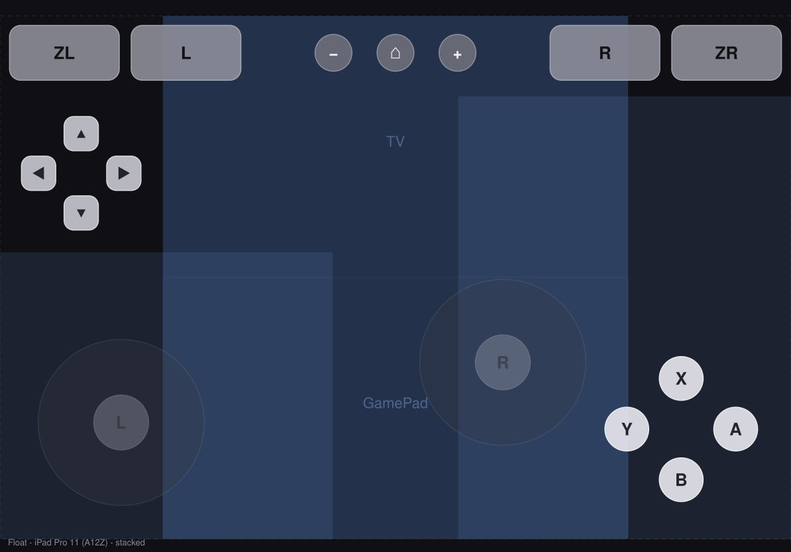
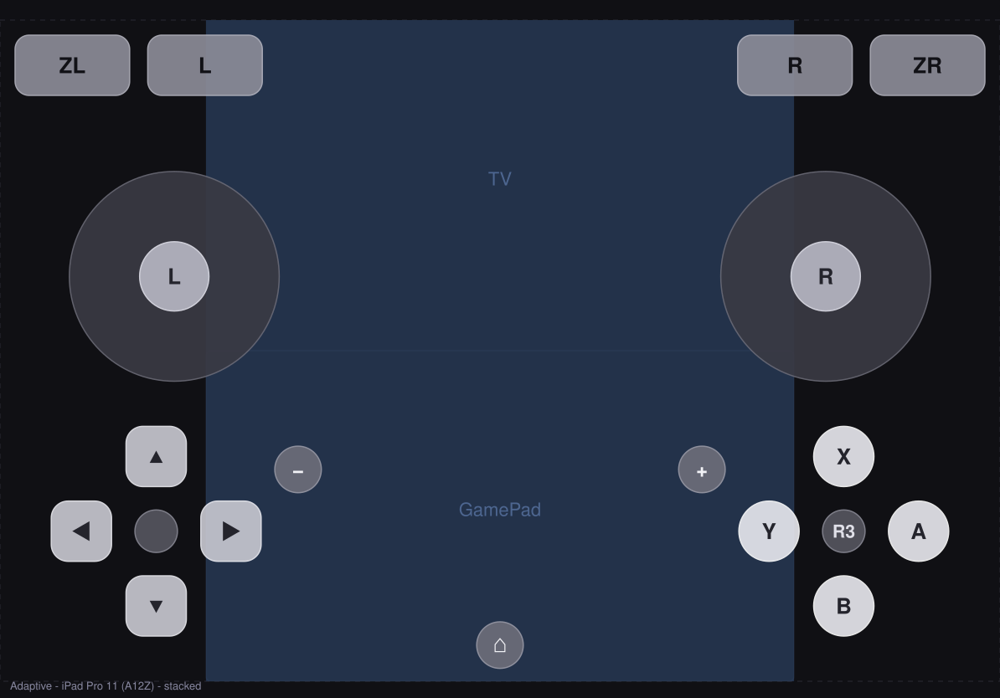
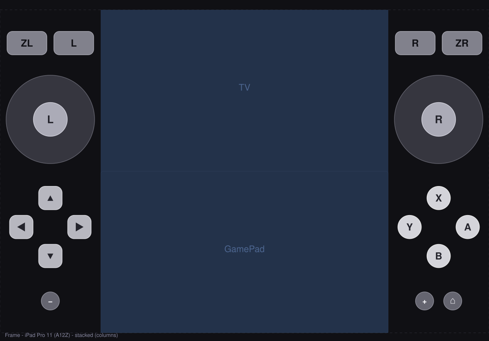

# MuffinEMU TouchLab

Four candidate on-screen control schemes for MuffinEMU, built outside the app so they can
be tried and compared without touching the shipping pad. Any of them could replace
Melo-Controller or the current Muffin pad: they emit exactly what those do, button
presses, stick axes and GamePad-touchscreen touches, through the same four bridge calls.

| Scheme | Idea | Preview (iPad Pro 11, TV + GamePad) |
|---|---|---|
| **Zone** | The GamePad's own layout (sticks above d-pad / face buttons, shoulders on the top edge). The input is rebuilt with gap-free catchment, an eight-way d-pad, sliding between buttons, and two-button presses in the gaps. |  |
| **Float** | For 3D games. A stick appears wherever the thumb lands, and the camera is a floating stick or a swipe. Double-tap-hold is L3/R3. |  |
| **Adaptive** | Zone's layout, but each group of buttons slowly moves toward where your thumbs actually press. It's bounded, only applies changes while no finger is down, and can be reset. |  |
| **Frame** | Controls fill the space around the game video and never cover it, so the GamePad screen stays a real touchscreen. Uses side columns or a bottom band, and falls back to Zone's layout when there's no usable margin. |  |

Every scheme on every target device (iPhone SE to iPad Pro 13, landscape and portrait,
one screen and two) is in [`docs/previews/`](docs/previews/index.html).

## How it's built

- **`TouchLabCore`** (no UIKit) holds the touch model and everything that decides what
  a finger means. `PadEngine` takes raw touches, the active scheme resolves each finger to
  a `Contribution`, and `PadMixer` folds all fingers together and reports only
  transitions. Presses are paired by construction: a button is held while any finger
  holds it, and a finger ending removes everything it contributed. No scheme sends a
  release by hand.
- **`TouchLabUI`** is one `UIView` that owns every finger, plus a SwiftUI wrapper. There's
  no per-button SwiftUI hit testing, which is the layer where the shipping pad's dead-button
  bugs came from. Unclaimed touches fall through `hitTest`. Every stuck-input path
  (touch cancelled, view removed, app resigning active, wrapper dismantled) is handled
  once, in the view.
- **`App/`** is a bench app (XcodeGen) with fake TV/GamePad screens, the pad, a live
  readout of what would be sent, and settings for scheme, screen layout, size, opacity,
  haptics, Float's camera mode and resetting Adaptive.
- **`integration/`** holds the reference `PadOutput` over `cemu_bridge_*` and the mount
  point in `EmulatorViewOptimized`. `PadButton`/`PadStick` raw values are the bridge's
  enum values.

## Checking

```
swift run touchlab-check          # behaviour + layout checks, runs with Command Line Tools
swift run touchlab-render docs/previews
```

`touchlab-check` covers:
- **Mixer:** pairing, two fingers on one button, stick hand-off.
- **Stick maths:** deadzone rescale, octagonal gate, y convention.
- **D-pad sectors.**
- **Every layout on every device:** no overlaps, inside the safe area, all 17 buttons
  and both sticks reachable, and Frame never covering the video.
- **Engine-level behaviour for each scheme:** taps, slides, chords, cancel, the
  d-pad and L3, stick travel, floating stick and double-tap, Adaptive drift and reset,
  and touchscreen passthrough.

CI runs those checks, builds the package for iOS and the bench app, and publishes an
unsigned `TouchLab.ipa`.

**None of this has been felt on a device yet.** Compiling and passing the checks proves the
logic, not the feel. Try it on the iPad before any of it goes near MuffinEMU.

## License

MPL-2.0, same as MuffinEMU.
